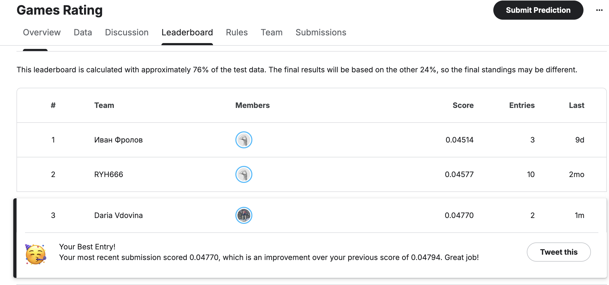

# 🎲 Board Games Rating Prediction (Regression)

Проект по прогнозированию среднего рейтинга настольных игр на основе характеристик с портала BoardGameGeek (BGG). 
Работа выполнена в рамках дисциплины "Классическое машинное обучение" магистерской программы НИЯУ МИФИ.

## 📌 Описание задачи
Цель — построить модель машинного обучения для предсказания целевого признака `Rating Average` (средний рейтинг игры). 
* **Данные:** Датасет содержит сведения о ~20 000 играх (количество игроков, время партии, жанры, механики, год издания и др.).
* **Метрика качества:** RMSE (Root Mean Squared Error).
* **Соревнование:** [Kaggle — Board Games Rating Prediction](https://www.kaggle.com/competitions/games-rating/data)

---

## 🛠 Технологический стек
* **Язык:** Python
* **Библиотеки:** Pandas, NumPy, Scikit-learn, Matplotlib, Seaborn.
* **Методы:** MultiLabelBinarizer, GridSearchCV, Ансамблевые методы (Gradient Boosting, Random Forest).

---

## 🔍 Ключевые этапы решения

### 1. Исследование и предобработка данных (EDA)
* **Коррекция типов:** Исправлены ошибки форматов в признаках `Complexity Average` и `Rating Average` (преобразование строковых значений с запятой в тип `float`).
* **Обработка пропусков:** Для числовых переменных (`Year Published`, `Owned Users`) использована медианная стратегия. Для категориальных признаков введен индикатор `Unknown`.

### 2. Feature Engineering и отбор признаков
* **Работа с мульти-категориями:** Признаки `Domains` и `Mechanics` содержат списки значений. Для их векторизации применен `MultiLabelBinarizer`.
* **Снижение размерности:** Из признака `Mechanics` отобраны только **Top-20** наиболее значимых категорий. Это позволило избежать «проклятия размерности» и повысить обобщающую способность модели.

### 3. Обучение и подбор моделей
В ходе работы проведено сравнение нескольких алгоритмов:
1. **Ridge Regression:** Использована в качестве Baseline (базового решения).
2. **Random Forest Regressor:** Показал высокую точность, но склонность к переобучению.
3. **Gradient Boosting Regressor:** **Выбран как лучшая модель.** С помощью `GridSearchCV` подобраны оптимальные параметры (`n_estimators=500`, `learning_rate=0.05`, `max_depth=5`), что обеспечило минимальную ошибку на тестовой выборке.

---

## 🏆 Результаты

| Модель | MSE (Validation) | RMSE (Kaggle) |
| :--- | :---: | :---: |
| **Gradient Boosting** | **0.043** | **0.44754** |

### Подтверждение позиции на лидерборде

---

## 📂 Структура репозитория
* `solution.py` — Воспроизводимый код решения (Data Cleaning, Feature Engineering, Training, Prediction).
* `result.png` — Скриншот с подтверждением результата на Kaggle.
